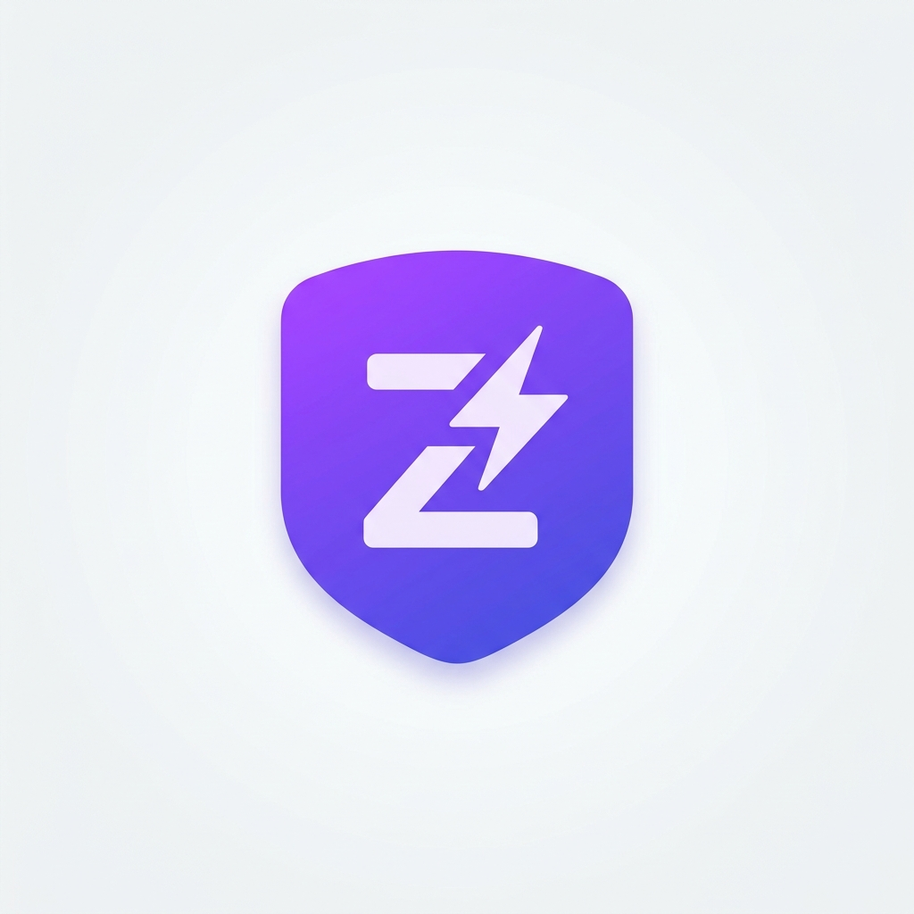

<p align="center">
  
</p>

<h1 align="center">zodify-express</h1>

<p align="center">
  <b>Type-safe Express routes with Zod validation — zero boilerplate.</b>
</p>

<p align="center">
  <a href="https://www.npmjs.com/package/zodify-express"></a>
  <a href="https://www.npmjs.com/package/zodify-express"></a>
  <a href="https://github.com/YOUR_USERNAME/zodify-express/blob/main/LICENSE"></a>
  
  
</p>

<br />

> **Validate once. Infer everywhere.** Define your Express route handlers with Zod schemas and get fully typed `req.body`, `req.query`, `req.params` — plus any custom properties like `req.user` — with zero manual type annotations.

---

## ✨ Features

- 🔒 **Zod-powered validation** — body, query, and params parsed & validated at runtime
- 🧠 **Full type inference** — no manual generics, no `as` casts, no `any`
- 👤 **Custom request properties** — type `req.user`, `req.session`, or anything your middleware adds
- 🎛️ **Customizable error handling** — plug in your own validation error response
- 📦 **Tiny footprint** — ~3 kB, zero runtime dependencies
- 🔀 **Dual CJS/ESM** — works everywhere, ships with `.d.ts` types

---

## 📦 Install

```bash
npm install zodify-express
```

> **Peer dependencies:** You also need `express` and `zod` in your project.
>
> ```bash
> npm install express zod
> ```

---

## 🚀 Quick Start

```ts
import express from "express";
import { z } from "zod";
import { defineRoute } from "zodify-express";

const app = express();
app.use(express.json());

app.post(
  "/users",
  defineRoute({
    body: z.object({
      name: z.string().min(1),
      email: z.string().email(),
    }),
    handler(req, res) {
      // ✅ req.body is { name: string; email: string } — fully typed!
      res.json({ message: `Welcome, ${req.body.name}!` });
    },
  })
);
```

That's it. If the body doesn't match the schema, the client gets a structured `400` response automatically:

```json
{
  "success": false,
  "message": "Validation failed",
  "errors": [
    { "path": "email", "message": "Invalid email" }
  ]
}
```

---

## 👤 Custom Request Properties (`req.user`, etc.)

Most real apps have auth middleware that attaches a `user` object to the request. Use `createRouteDefiner` to tell TypeScript about it — once — and every route handler gets the types for free:

```ts
import { createRouteDefiner } from "zodify-express";
import { z } from "zod";

// 1. Describe what your middleware adds to `req`
const defineRoute = createRouteDefiner<{
  user: { id: string; role: "admin" | "member" };
}>();

// 2. Use it everywhere — req.user is auto-inferred
export const getProfile = defineRoute({
  params: z.object({ id: z.string().uuid() }),
  handler(req, res) {
    req.user.id;     // ✅ string
    req.user.role;   // ✅ "admin" | "member"
    req.params.id;   // ✅ string (Zod-validated UUID)

    res.json({ profile: req.user });
  },
});
```

You can add as many custom properties as you need:

```ts
const defineRoute = createRouteDefiner<{
  user: { id: string; role: string };
  session: { token: string; expiresAt: Date };
  requestId: string;
}>();
```

---

## 🎛️ Custom Error Handling

Don't like the default 400 response? Provide your own:

```ts
const defineRoute = createRouteDefiner({
  onValidationError(error, req, res, next) {
    // Forward to your global error handler
    next(error);
  },
});
```

Or return a custom format:

```ts
const defineRoute = createRouteDefiner({
  onValidationError(error, req, res) {
    res.status(422).json({
      code: "VALIDATION_ERROR",
      details: error.issues,
    });
  },
});
```

---

## 📖 Full API

### `defineRoute(config)`

A pre-built route definer with no extra request properties. Great for simple apps.

```ts
import { defineRoute } from "zodify-express";
```

| Config Field | Type | Description |
|---|---|---|
| `body` | `ZodSchema` | Validates `req.body` |
| `query` | `ZodSchema` | Validates `req.query` |
| `params` | `ZodSchema` | Validates `req.params` |
| `handler` | `(req, res, next) => void` | Your route logic with fully typed `req` |

All schema fields are optional — only provided schemas are validated.

---

### `createRouteDefiner<TExtra>(options?)`

Factory that returns a `defineRoute` function with custom `req` properties baked in.

**Type Parameter:**

| Param | Description |
|---|---|
| `TExtra` | An object type describing additional properties on `req` (e.g. `{ user: User }`) |

**Options:**

| Option | Type | Default | Description |
|---|---|---|---|
| `onValidationError` | `(error, req, res, next) => void` | Built-in 400 JSON response | Custom validation error handler |

---

### Exported Types

```ts
import type {
  ValidatedRequest,   // The augmented Request type
  RouteConfig,        // Config object passed to defineRoute
  ValidationSchemas,  // Just the body/query/params schema fields
  RouteDefinerOptions // Options for createRouteDefiner
} from "zodify-express";
```

---

## 🧩 Patterns & Recipes

### Validate query params with coercion

```ts
defineRoute({
  query: z.object({
    page: z.coerce.number().min(1).default(1),
    limit: z.coerce.number().min(1).max(100).default(20),
  }),
  handler(req, res) {
    // req.query.page  → number ✅
    // req.query.limit → number ✅
  },
});
```

### Validate route params

```ts
defineRoute({
  params: z.object({
    id: z.string().uuid(),
  }),
  handler(req, res) {
    // req.params.id → string (validated UUID) ✅
  },
});
```

### Validate everything at once

```ts
defineRoute({
  params: z.object({ id: z.string().uuid() }),
  query: z.object({ include: z.enum(["posts", "comments"]).optional() }),
  body: z.object({ name: z.string(), bio: z.string().max(500) }),
  handler(req, res) {
    // req.params.id        → string
    // req.query.include    → "posts" | "comments" | undefined
    // req.body.name        → string
    // req.body.bio         → string
  },
});
```

### Use with Express Router

```ts
import { Router } from "express";
import { z } from "zod";
import { defineRoute } from "zodify-express";

const router = Router();

router.get(
  "/:id",
  defineRoute({
    params: z.object({ id: z.string().uuid() }),
    handler(req, res) {
      res.json({ id: req.params.id });
    },
  })
);

export default router;
```

---

## ⚙️ How It Works

```
   Client Request
        │
        ▼
  ┌─────────────┐
  │  Express    │
  │  Middleware │  ← your auth middleware adds req.user
  └──────┬──────┘
         │
         ▼
  ┌─────────────┐     ┌──────────────┐
  │  defineRoute│────▶│  Zod Parse   │  ← validates body/query/params
  └──────┬──────┘     └──────┬───────┘
         │                   │
         │  validation ok    │  validation fails
         ▼                   ▼
  ┌─────────────┐     ┌──────────────┐
  │  handler()  │     │  400 JSON    │  ← or your custom error handler
  │  fully typed│     │  response    │
  └─────────────┘     └──────────────┘
```

---

## 📄 License

[MIT](LICENSE) — use it however you like.
